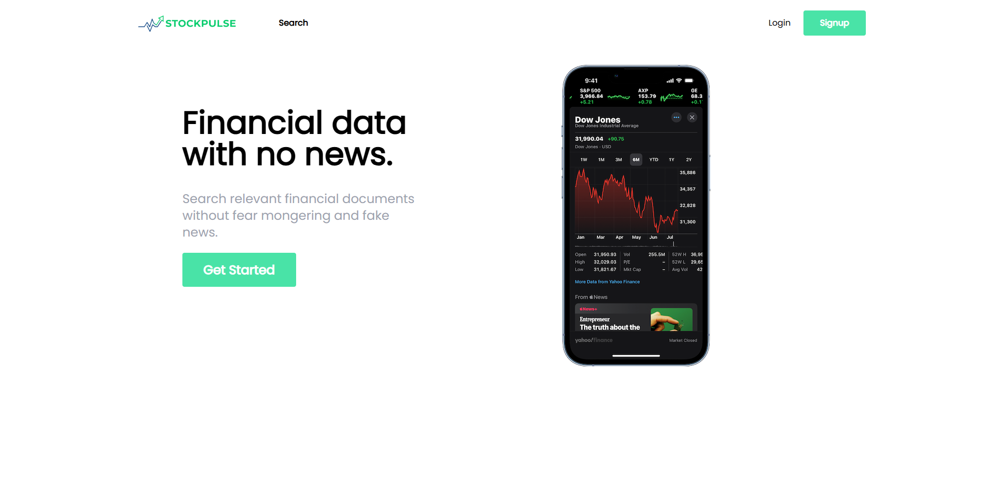

# 📈 StockPulse

> **A full-stack stock market analysis and portfolio management platform**
> Built by **Omar AbdElaty**

---



## Table of Contents

1. [Project Overview](#project-overview)
2. [Architecture](#architecture)
3. [Tech Stack](#tech-stack)
4. [Getting Started](#getting-started)
5. [Backend API Reference](#backend-api-reference)
   - [Authentication](#1-authentication-apiaccount)
   - [Stocks](#2-stocks-apistock)
   - [Comments](#3-comments-apicomment)
   - [Portfolio](#4-portfolio-apiportfolio)
6. [Data Models & Database Schema](#data-models--database-schema)
7. [Frontend Documentation](#frontend-documentation)
   - [Pages & Routing](#pages--routing)
   - [Components](#components)
   - [Services](#services)
   - [Auth System](#auth-system)
   - [External API Integration](#external-api-integration-fmp)
8. [Environment Configuration](#environment-configuration)
9. [Security](#security)
10. [Deployment](#deployment)

---

## Project Overview

**StockPulse** is a modern, full-stack web application that lets users search for stocks, view detailed financial data, manage a personal portfolio, and discuss stocks through a comment system. It combines a **.NET 8 REST API** backend with a **React + TypeScript** frontend, pulling real-time financial data from the **Financial Modeling Prep (FMP)** API.

### What You Can Do

| Feature                     | Description                                                        |
| --------------------------- | ------------------------------------------------------------------ |
| 🔍 **Search Stocks**        | Search NASDAQ-listed companies by name or ticker symbol            |
| 📊 **Financial Analysis**   | View income statements, balance sheets, cash flow, and key metrics |
| 💼 **Portfolio Management** | Add/remove stocks to a personal watchlist portfolio                |
| 💬 **Stock Comments**       | Post and read discussions on any stock (tied to your account)      |
| 🔐 **User Accounts**        | Register, login, and manage sessions with JWT authentication       |
| 📈 **Historical Dividends** | Track dividend history and patterns for any company                |
| 📋 **SEC Filings**          | Access 10-K filings directly from SEC                              |

---

## Architecture

StockPulse follows a clean **client-server architecture** with clear separation of concerns on both sides.

```
Frontend (React + TypeScript)
├── UI Components
├── Service Layer  ──────────────────► Backend Controllers
├── Auth Context                              │
└── FMP API Client ──────┐           Repository & Service Layer
                         │                    │
                    FMP External API      SQL Server DB
```

### Backend Architecture

The API uses the **Repository Pattern** to keep data access separate from business logic:

- **Controllers** — Handle HTTP requests, validate input, return responses
- **Repositories** — Data access through Entity Framework Core (one per entity)
- **Services** — Business logic like token generation and external API calls
- **DTOs** — Shape data going in/out without exposing internal models
- **Mappers** — Convert between domain models and DTOs (extension methods)

### Frontend Architecture

The React app is organized by feature:

- **Pages** — Full page views (Home, Search, Company, Login, Register)
- **Components** — Reusable UI pieces (Navbar, Cards, Tables, Charts)
- **Services** — API communication layer (auth, comments, portfolio)
- **Context** — Global state management (authentication)
- **Models** — TypeScript type definitions
- **Helpers** — Utility functions (error handling, number formatting)

---

## Tech Stack

### Backend

| Technology                  | Purpose                          |
| --------------------------- | -------------------------------- |
| **.NET 8**                  | Web API framework                |
| **ASP.NET Core Identity**   | User management & authentication |
| **Entity Framework Core 8** | ORM / database access            |
| **SQL Server**              | Relational database              |
| **JWT Bearer Tokens**       | Stateless authentication         |
| **Newtonsoft.Json**         | JSON serialization               |
| **Swashbuckle (Swagger)**   | API documentation & testing UI   |
| **DotNetEnv**               | Environment variable loading     |

### Frontend

| Technology                | Purpose                     |
| ------------------------- | --------------------------- |
| **React 18**              | UI framework                |
| **TypeScript**            | Type safety                 |
| **React Router DOM 6**    | Client-side routing         |
| **Axios**                 | HTTP client for API calls   |
| **React Hook Form + Yup** | Form handling & validation  |
| **Recharts**              | Data visualization / charts |
| **React Toastify**        | Toast notifications         |
| **React Icons**           | Icon library                |
| **React Spinners**        | Loading indicators          |
| **TailwindCSS 3**         | Utility-first CSS styling   |

---

## Getting Started

### Prerequisites

- [.NET 8 SDK](https://dotnet.microsoft.com/download/dotnet/8.0)
- [Node.js 18+](https://nodejs.org/) (includes npm)
- [SQL Server](https://www.microsoft.com/en-us/sql-server) (or SQL Server Express / LocalDB)
- A [Financial Modeling Prep](https://financialmodelingprep.com/) API key (free tier available)

### 1. Clone the Repository

```bash
git clone <repository-url>
cd StockPulse
```

### 2. Set Up the Backend

```bash
cd api
```

Create a `.env` file in the `api/` directory with your secrets:

```env
ConnectionStrings__DefaultConnection=Server=localhost;Database=StockPulse;Trusted_Connection=True;TrustServerCertificate=True;
JWT__Issuer=http://localhost:5167
JWT__Audience=http://localhost:5167
JWT__SigningKey=YourSuperSecretKeyThatIsAtLeast64CharactersLong_ChangeThis!
FMPKey=your_fmp_api_key_here
```

> **⚠️ Important:** The `appsettings.json` ships with empty values on purpose. **All secrets go in the `.env` file** and are loaded at startup via `DotNetEnv`. Never commit real keys.

Apply database migrations and start the API:

```bash
dotnet ef database update
dotnet run
```

The API starts at `http://localhost:5167` by default. Swagger UI is available at `http://localhost:5167/swagger` in development.

### 3. Set Up the Frontend

```bash
cd frontend
npm install
```

Create a `.env` file in `frontend/`:

```env
REACT_APP_API_KEY=your_fmp_api_key_here
REACT_APP_API_URL=http://localhost:5167/api/
```

Start the dev server:

```bash
npm start
```

The frontend runs at `http://localhost:3000`.

### 4. Verify Everything Works

1. Open `http://localhost:5167/swagger` — you should see the API docs
2. Open `http://localhost:3000` — you should see the StockPulse homepage
3. Register a new account, then search for a stock like `AAPL`

---

## Backend API Reference

**Base URL:** `http://localhost:5167/api`

All protected endpoints require a `Bearer` token in the `Authorization` header:

```
Authorization: Bearer <your-jwt-token>
```

---

### 1. Authentication (`api/account`)

Handles user registration and login. Returns a JWT token on success.

#### `POST /api/account/register`

Create a new user account.

**Request Body:**

```json
{
  "username": "johndoe",
  "email": "john@example.com",
  "password": "SecurePass123!"
}
```

| Field      | Type     | Rules                                                                                    |
| ---------- | -------- | ---------------------------------------------------------------------------------------- |
| `username` | `string` | Required                                                                                 |
| `email`    | `string` | Required, must be a valid email                                                          |
| `password` | `string` | Required — min 12 chars, must include uppercase, lowercase, digit, and special character |

**Response `200 OK`:**

```json
{
  "userName": "johndoe",
  "email": "john@example.com",
  "token": "eyJhbGci..."
}
```

**Error Responses:**

- `400 Bad Request` — Validation errors (weak password, duplicate username, etc.)
- `500 Internal Server Error` — Unexpected failure

---

#### `POST /api/account/login`

Sign in with existing credentials.

**Request Body:**

```json
{
  "username": "johndoe",
  "password": "SecurePass123!"
}
```

**Response `200 OK`:**

```json
{
  "userName": "johndoe",
  "email": "john@example.com",
  "token": "eyJhbGci..."
}
```

**Error Responses:**

- `400 Bad Request` — Invalid model state
- `401 Unauthorized` — Wrong username or password

---

### 2. Stocks (`api/stock`)

Manage stock records in the local database. Most endpoints require authentication.

#### `GET /api/stock` 🔒

Retrieve a paginated, filterable list of all stocks.

**Query Parameters:**

| Parameter      | Type      | Default | Description                                |
| -------------- | --------- | ------- | ------------------------------------------ |
| `Symbol`       | `string?` | `null`  | Filter by ticker symbol (partial match)    |
| `CompanyName`  | `string?` | `null`  | Filter by company name (partial match)     |
| `SortBy`       | `string?` | `null`  | Sort field — currently supports `"Symbol"` |
| `IsDecsending` | `bool`    | `false` | Sort direction — `true` for descending     |
| `PageNumber`   | `int`     | `1`     | Page number (min: 1)                       |
| `PageSize`     | `int`     | `20`    | Items per page (1–100)                     |

**Example Request:**

```
GET /api/stock?Symbol=AAPL&PageSize=10&SortBy=Symbol&IsDecsending=true
```

**Response `200 OK`:**

```json
[
  {
    "id": 1,
    "symbol": "AAPL",
    "companyName": "Apple Inc.",
    "purchase": 178.5,
    "lastDiv": 0.96,
    "industry": "Technology",
    "marketCap": 2800000000000,
    "comments": []
  }
]
```

---

#### `GET /api/stock/{id}`

Get a single stock by its database ID. **No auth required.**

**Response `200 OK`:** Same shape as the stock object above.

**Error:** `404 Not Found` if the ID doesn't exist.

---

#### `POST /api/stock` 🔒

Create a new stock record manually.

**Request Body:**

```json
{
  "symbol": "MSFT",
  "companyName": "Microsoft",
  "purchase": 380.0,
  "lastDiv": 3.0,
  "industry": "Tech",
  "marketCap": 2900000000000
}
```

| Field         | Type      | Rules                           |
| ------------- | --------- | ------------------------------- |
| `symbol`      | `string`  | Required, max 10 chars          |
| `companyName` | `string`  | Required, max 10 chars          |
| `purchase`    | `decimal` | Required, range 1–1,000,000,000 |
| `lastDiv`     | `decimal` | Required, range 0.001–100       |
| `industry`    | `string`  | Required, max 10 chars          |
| `marketCap`   | `long`    | Range 1–5,000,000,000           |

**Response `201 Created`:** Returns the created stock with its new `id`.

---

#### `PUT /api/stock/{id}` 🔒

Update an existing stock. Same body as `POST`.

**Response:** `200 OK` with updated stock, or `404 Not Found`.

---

#### `DELETE /api/stock/{id}` 🔒

Remove a stock from the database.

**Response:** `204 No Content` on success, `404 Not Found` if not found.

---

### 3. Comments (`api/comment`)

Users can discuss stocks by posting comments. Each comment is tied to a stock and the user who wrote it. Only the author can edit or delete their own comments.

#### `GET /api/comment` 🔒

Get all comments, optionally filtered by stock symbol.

**Query Parameters:**

| Parameter      | Type     | Default | Description                     |
| -------------- | -------- | ------- | ------------------------------- |
| `Symbol`       | `string` | —       | Filter comments by stock symbol |
| `IsDecsending` | `bool`   | `true`  | Sort by date descending         |

**Response `200 OK`:**

```json
[
  {
    "id": 1,
    "title": "Bullish on AAPL",
    "content": "Strong earnings this quarter.",
    "createdOn": "2026-03-15T10:30:00",
    "createdBy": "johndoe",
    "stockId": 1
  }
]
```

---

#### `GET /api/comment/{id}`

Get a single comment by ID. **No auth required.**

---

#### `POST /api/comment/{symbol}` 🔒

Post a new comment on a stock. If the stock doesn't exist locally, the API will fetch it from FMP and create it first.

**Route Parameter:** `symbol` — The stock ticker (e.g., `AAPL`)

**Request Body:**

```json
{
  "title": "Great quarter!",
  "content": "Revenue beat expectations significantly."
}
```

| Field     | Type     | Rules                      |
| --------- | -------- | -------------------------- |
| `title`   | `string` | Required, 5–280 characters |
| `content` | `string` | Required, 5–280 characters |

**Response:** `201 Created` with the new comment.

**Errors:**

- `400 Bad Request` — Stock not found on FMP either
- `401 Unauthorized` — Not logged in

---

#### `PUT /api/comment/{id}` 🔒

Update your own comment. Same body as `POST`.

**Errors:**

- `403 Forbidden` — You can only edit your own comments
- `404 Not Found` — Comment doesn't exist

---

#### `DELETE /api/comment/{id}` 🔒

Delete your own comment.

**Errors:**

- `403 Forbidden` — You can only delete your own comments
- `404 Not Found` — Comment doesn't exist

---

### 4. Portfolio (`api/portfolio`)

Each user has a personal portfolio (watchlist) of stocks. All endpoints require authentication.

#### `GET /api/portfolio` 🔒

Get the logged-in user's portfolio.

**Response `200 OK`:**

```json
[
  {
    "id": 1,
    "symbol": "AAPL",
    "companyName": "Apple Inc.",
    "purchase": 178.5,
    "lastDiv": 0.96,
    "industry": "Technology",
    "marketCap": 2800000000000,
    "comments": []
  }
]
```

---

#### `POST /api/portfolio?symbol={symbol}` 🔒

Add a stock to your portfolio. If the stock doesn't exist locally, it will be fetched from FMP.

**Query Parameter:** `symbol` — Ticker to add (e.g., `TSLA`)

**Response:** `201 Created` on success.

**Errors:** `400 Bad Request` — Stock not found, or already in your portfolio.

---

#### `DELETE /api/portfolio?symbol={symbol}` 🔒

Remove a stock from your portfolio.

**Query Parameter:** `symbol` — Ticker to remove

**Response:** `200 OK` on success.

**Error:** `400 Bad Request` — Stock not in your portfolio.

---

## Data Models & Database Schema

### Entity Relationships

```
AppUser ──< Portfolio >── Stock
AppUser ──< Comment  >── Stock

AppUser    { Id, UserName, Email, PasswordHash }
Stock      { Id, Symbol, CompanyName, Purchase, LastDiv, Industry, MarketCap }
Comment    { Id, Title, Content, CreatedOn, StockId (FK), AppUserId (FK) }
Portfolio  { AppUserId (PK/FK), StockId (PK/FK) }
```

### Key Design Decisions

- **Portfolio** uses a **composite primary key** (`AppUserId` + `StockId`) — a user can't add the same stock twice
- **AppUser** extends `IdentityUser`, inheriting all ASP.NET Identity fields
- **Comments** track who wrote them (`AppUserId`) so only the author can edit/delete
- Two **seeded roles** exist: `Admin` and `User`. New registrations are assigned the `User` role

### Database Tables

| Table             | Description                                  |
| ----------------- | -------------------------------------------- |
| `Stocks`          | Company stock records with financial summary |
| `Comments`        | User comments attached to stocks             |
| `Portfolios`      | Many-to-many join between users and stocks   |
| `AspNetUsers`     | Identity table for user accounts             |
| `AspNetRoles`     | Identity table for roles (`Admin`, `User`)   |
| `AspNetUserRoles` | Join table for user-role assignments         |

---

## Frontend Documentation

### Pages & Routing

The app uses **React Router v6** with the following routes:

| Route                                  | Page                 | Auth Required | Description                       |
| -------------------------------------- | -------------------- | :-----------: | --------------------------------- |
| `/`                                    | `HomePage`           |      ❌       | Landing page with hero section    |
| `/login`                               | `LoginPage`          |      ❌       | User login form                   |
| `/register`                            | `RegisterPage`       |      ❌       | User registration form            |
| `/search`                              | `SearchPage`         |      ✅       | Search and browse stocks          |
| `/company/:ticker`                     | `CompanyPage`        |      ✅       | Stock dashboard with nested views |
| `/company/:ticker/company-profile`     | `CompanyProfile`     |      ✅       | Detailed company info             |
| `/company/:ticker/income-statement`    | `IncomeStatement`    |      ✅       | Income statement table            |
| `/company/:ticker/balance-sheet`       | `BalanceSheet`       |      ✅       | Balance sheet table               |
| `/company/:ticker/cashflow-statement`  | `CashflowStatement`  |      ✅       | Cash flow table                   |
| `/company/:ticker/historical-dividend` | `HistoricalDividend` |      ✅       | Dividend history                  |
| `/design-guide`                        | `DesignGuide`        |      ❌       | UI component reference            |

Protected routes redirect unauthenticated users to `/login` and remember where they came from.

### Components

The frontend has **23 reusable components** organized by feature:

**Navigation & Layout**

| Component | Purpose                                  |
| --------- | ---------------------------------------- |
| `Navbar`  | Top navigation bar with auth-aware links |
| `Sidebar` | Company page sidebar navigation          |
| `Hero`    | Landing page hero section                |

**Stock Data Display**

| Component            | Purpose                           |
| -------------------- | --------------------------------- |
| `CompanyProfile`     | Full company info card            |
| `CompanyDashboard`   | Main dashboard layout for a stock |
| `IncomeStatement`    | Income statement data table       |
| `BalanceSheet`       | Balance sheet data table          |
| `CashflowStatement`  | Cash flow statement table         |
| `HistoricalDividend` | Dividend history chart/table      |
| `RatioList`          | Key financial ratios display      |
| `SimpleLineChart`    | Line chart for data visualization |

**Search & Discovery**

| Component    | Purpose                        |
| ------------ | ------------------------------ |
| `Search`     | Search input with results      |
| `CompFinder` | Company peer/competitor finder |
| `TenKFinder` | 10-K SEC filing finder         |

**Cards & Lists**

| Component   | Purpose                       |
| ----------- | ----------------------------- |
| `Card`      | Individual stock card         |
| `CardList`  | Grid/list of stock cards      |
| `Table`     | Reusable data table component |
| `Tile`      | Info tile component           |
| `Portfolio` | Portfolio stock list          |

**Comments**

| Component              | Purpose                      |
| ---------------------- | ---------------------------- |
| `StockComment`         | Comment form component       |
| `StockCommentList`     | List of comments for a stock |
| `StockCommentListItem` | Single comment display       |

**Utility**

| Component  | Purpose                    |
| ---------- | -------------------------- |
| `Spinners` | Loading spinner animations |

### Services

Three service modules handle all communication with the backend API:

#### `AuthService.tsx`

| Function                                 | Method | Endpoint                | Description                       |
| ---------------------------------------- | ------ | ----------------------- | --------------------------------- |
| `loginAPI(username, password)`           | `POST` | `/api/account/login`    | Authenticate user, returns token  |
| `registerAPI(email, username, password)` | `POST` | `/api/account/register` | Create new account, returns token |

#### `CommentService.tsx`

| Function                                 | Method | Endpoint                       | Description               |
| ---------------------------------------- | ------ | ------------------------------ | ------------------------- |
| `commentPostAPI(title, content, symbol)` | `POST` | `/api/comment/{symbol}`        | Post a comment on a stock |
| `commentGetAPI(symbol)`                  | `GET`  | `/api/comment?Symbol={symbol}` | Get comments for a stock  |

#### `PortfolioService.tsx`

| Function                     | Method   | Endpoint                         | Description                 |
| ---------------------------- | -------- | -------------------------------- | --------------------------- |
| `portfolioAddAPI(symbol)`    | `POST`   | `/api/portfolio?symbol={symbol}` | Add stock to portfolio      |
| `portfolioDeleteAPI(symbol)` | `DELETE` | `/api/portfolio?symbol={symbol}` | Remove stock from portfolio |
| `portfolioGetAPI()`          | `GET`    | `/api/portfolio`                 | Get user's full portfolio   |

### External API Integration (FMP)

The frontend directly calls the Financial Modeling Prep API for real-time data via `src/api.tsx`:

| Function                        | FMP Endpoint                                            | Data Returned                           |
| ------------------------------- | ------------------------------------------------------- | --------------------------------------- |
| `searchCompanies(query)`        | `/api/v3/search`                                        | Stock search results (NASDAQ, limit 10) |
| `getCompanyProfile(symbol)`     | `/api/v3/profile/{symbol}`                              | Company profile & overview              |
| `getKeyMetrics(symbol)`         | `/api/v3/key-metrics-ttm/{symbol}`                      | Key financial metrics (TTM)             |
| `getIncomeStatement(symbol)`    | `/api/v3/income-statement/{symbol}`                     | Income statements (up to 50)            |
| `getBalanceSheet(symbol)`       | `/api/v3/balance-sheet-statement/{symbol}`              | Balance sheets (up to 20)               |
| `getCashFlow(symbol)`           | `/api/v3/cash-flow-statement/{symbol}`                  | Cash flow statements (up to 100)        |
| `getCompData(symbol)`           | `/api/v4/stock_peers`                                   | Peer/competitor companies               |
| `getTenK(symbol)`               | `/api/v3/sec_filings/{symbol}`                          | 10-K SEC filing links                   |
| `getHistoricalDividend(symbol)` | `/api/v3/historical-price-full/stock_dividend/{symbol}` | Full dividend history                   |

> **Note:** The FMP API key is passed via `process.env.REACT_APP_API_KEY`. Both the frontend and backend use FMP — the backend uses it to auto-create stock records when a user adds an unknown ticker to their portfolio or posts a comment.

### Auth System

Authentication flows through a React Context (`useAuth`) that manages the full lifecycle:

1. User enters credentials → `POST /api/account/login`
2. API returns `{ userName, email, token }`
3. Token + user saved to `localStorage`
4. Axios default `Authorization` header is set globally
5. User is redirected to `/search`

**On page reload:** token is read from `localStorage` and auth state is restored automatically.

**On logout:** `localStorage` is cleared, the Axios header is removed, and the user is redirected to `/`.

**Key behaviors:**

- Tokens are stored in `localStorage` and restored on page reload
- Protected routes (`ProtectedRoute`) redirect to `/login` if no active session
- Session persistence survives browser refresh

---

## Environment Configuration

### Backend (`api/.env`)

| Variable                               | Required | Description                                              |
| -------------------------------------- | :------: | -------------------------------------------------------- |
| `ConnectionStrings__DefaultConnection` |    ✅    | SQL Server connection string                             |
| `JWT__Issuer`                          |    ✅    | JWT token issuer (your API URL)                          |
| `JWT__Audience`                        |    ✅    | JWT token audience (your API URL)                        |
| `JWT__SigningKey`                      |    ✅    | Secret key for signing tokens (min 64 chars recommended) |
| `FMPKey`                               |    ✅    | Financial Modeling Prep API key                          |

### Backend (`api/appsettings.json`)

| Key                   | Description                                                          |
| --------------------- | -------------------------------------------------------------------- |
| `Cors:AllowedOrigins` | Array of allowed frontend URLs (defaults to `http://localhost:3000`) |
| `Logging:LogLevel`    | Standard .NET logging configuration                                  |

### Frontend (`frontend/.env`)

| Variable            | Required | Description                                               |
| ------------------- | :------: | --------------------------------------------------------- |
| `REACT_APP_API_KEY` |    ✅    | FMP API key for direct frontend calls                     |
| `REACT_APP_API_URL` |    ✅    | Backend API base URL (e.g., `http://localhost:5167/api/`) |

> **⚠️ Caution:** The `.env` files contain secrets. They are listed in `.gitignore` and must **never** be committed to version control.

---

## Security

### Authentication

- **JWT Bearer Tokens** — Stateless, issued on login/register, valid for **7 days**
- **HMAC-SHA512** signing algorithm
- Token validation checks: issuer, audience, lifetime, and signing key
- **1-minute clock skew** tolerance for token expiry

### Password Policy

| Rule              | Requirement   |
| ----------------- | ------------- |
| Minimum length    | 12 characters |
| Uppercase letter  | At least one  |
| Lowercase letter  | At least one  |
| Digit             | At least one  |
| Special character | At least one  |

### Authorization

- **Role-based access:** Two roles seeded — `Admin` and `User`
- **Resource-level protection:** Users can only edit/delete their own comments (ownership check in controller)
- **Protected routes:** Frontend prevents navigation to authenticated pages without a valid session

### CORS Policy

The API restricts cross-origin requests to configured frontend URLs only. Default: `http://localhost:3000`. Configurable via `Cors:AllowedOrigins` in `appsettings.json`.

### Secrets Management

- All sensitive values live in `.env` files (loaded at runtime by `DotNetEnv`)
- `appsettings.json` ships with empty placeholder values
- `.gitignore` excludes `.env` files from version control

---

## Deployment

### Frontend Production Build

```bash
cd frontend
npm run build
```

Creates an optimized build in `frontend/build/`. Serve with any static file host (Nginx, Vercel, Azure Static Web Apps, etc.).

### Backend Production Build

```bash
cd api
dotnet publish -c Release -o ./publish
```

The output in `api/publish/` can be deployed to Azure App Service, IIS, Docker, or any .NET 8 compatible host.

### Environment Variables in Production

| Platform          | How to Set                                      |
| ----------------- | ----------------------------------------------- |
| Azure App Service | Configuration > Application settings            |
| Docker            | `-e` flags or docker-compose `environment`      |
| IIS               | Web.config `environmentVariables` section       |
| Linux             | Export in systemd service file or shell profile |

### Production Checklist

- [ ] Set `ASPNETCORE_ENVIRONMENT` to `Production` (disables Swagger UI)
- [ ] Use a strong, unique `JWT:SigningKey` (64+ characters)
- [ ] Configure a production SQL Server with proper credentials
- [ ] Set `Cors:AllowedOrigins` to your actual frontend domain
- [ ] Enable HTTPS on both frontend and backend
- [ ] Set `REACT_APP_API_URL` to your production API URL
- [ ] Replace the FMP API key if a different one is needed for production

---

## Project Structure

```
StockPulse/
├── StockPulse.sln
│
├── api/                              # .NET 8 Backend
│   ├── Program.cs
│   ├── appsettings.json
│   ├── .env                          # (git-ignored)
│   ├── Controllers/
│   │   ├── AccountController.cs
│   │   ├── StockController.cs
│   │   ├── CommentController.cs
│   │   └── PortfolioController.cs
│   ├── Models/
│   │   ├── AppUser.cs
│   │   ├── Stock.cs
│   │   ├── Comment.cs
│   │   └── Portfolio.cs
│   ├── Dtos/
│   │   ├── Account/
│   │   ├── Stock/
│   │   └── Comment/
│   ├── Interfaces/
│   ├── Repository/
│   ├── Service/
│   ├── Mappers/
│   ├── Helpers/
│   ├── Extensions/
│   ├── Data/
│   └── Migrations/
│
└── frontend/                         # React + TypeScript Frontend
    ├── package.json
    ├── tsconfig.json
    ├── tailwind.config.js
    ├── .env                          # (git-ignored)
    └── src/
        ├── App.tsx
        ├── index.tsx
        ├── api.tsx
        ├── Pages/
        │   ├── HomePage/
        │   ├── SearchPage/
        │   ├── CompanyPage/
        │   ├── LoginPage/
        │   └── RegisterPage/
        ├── Components/               # 23 reusable components
        ├── Services/
        │   ├── AuthService.tsx
        │   ├── CommentService.tsx
        │   └── PortfolioService.tsx
        ├── Context/
        │   └── useAuth.tsx
        ├── Routes/
        │   ├── Routes.tsx
        │   └── ProtectedRoute.tsx
        ├── Models/
        └── Helpers/
```

---

> Built with ❤️ by **Omar AbdElaty**
